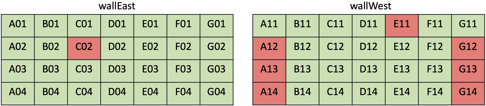

# Fleet management Ansible playbooks for Techtile Raspberry Pis

## Hosts/Tiles
Host inventory: `inventory/hosts.yaml`  

The inventory defines different children groups of all hosts based on hosts location/function.
* **server**: Techtile server, the `ansible_user` variable value may need to be changed to another user account.
* **tests**: Rpi hosts used for testing.
* **wallEast, wallWest**: Configugreen and accessible Rpi hosts mounted on east and west walls.
* **segmentA -- segmentG**: Configured and accessible Rpi hosts grouped by segments A -- G.
* **multiON**: Add any hosts to this group, playbook `start_receiver_multi.yaml` starts the receivers of Rpis within this group.
* **rpis**: parent group of wallEast and wallWest, contains all the Rpis have been configured and accessible
* **fail**: hosts within this group are currently not accessible. Move the hosts to wallEast/wallWest and corresponding segment groups once they become accessible and get configured. 

Layout of Current Rpis (Red tile: inaccessible, Green tile: accessible and configured)


## Example server/client files
* `server/`: Source files in Python for techtile server, starting PUSH, PUB and ROUTER zeroMQ servers to distributing tasks, receiving results and sending killing message to clients(rpis). Three alternatives to start the server. The task asks each Rpis to start receiving for 5 seconds, and send the 5s I/Q data back to the server. If needs longer receiving time, you can change the `duration` value in the `central_server` scripts in each method. The data sent back by all Rpis will be saved in `data/` under the same directory.
* `client/`: Source files in Python for all rpis, connecting to each zeroMQ server for receiving tasks, sending results and receiving killing signals. 
To copy all files to rpis and the server, run:
```
ansible-playbook -i inventory/hosts.yaml copy-scripts.yaml
```
The playbook ` copy-scripts.yaml` copies `src/client` to `/home/pi/client` on all Rpis, and `src/server` to `/home/techtile/server`. The destination path of server `/home/techtile/server` may need to be changed depends on the user account that is used on the server.  
To only copy the client scripts:
```
ansible-playbook -i inventory/hosts.yaml -l rpis copy-scripts.yaml
``` 
To only copy the server scripts:
```
ansible-playbook -i inventory/hosts.yaml -l server copy-scripts.yaml
``` 
To only copy to a specific Rpis host (A01 for example):
```
ansible-playbook -i inventory/hosts.yaml -l A01 copy-scripts.yaml
```
To copy all files in src/client to all (or specific) Rpis host (A01 for example):
```
ansible-playbook -i inventory/hosts.yaml copy-all-scripts.yaml
```
```
ansible-playbook -i inventory/hosts.yaml -l A01 copy-all-scripts.yaml
``` 

## Start USRP receivers on Rpis
There are few ways to start the receivers on Rpis
### Start receivers by wall
By default, all Rpis on wallEast connect to zeroMQ servers binding port 5555-5557, all Rpis on wallWest connects to zeroMQ servers binding port 6555-6557. 
```
{
    wallEast: 5555-5557
    wallWest: 6555-6557
}
```
This can be changed in `inventory/group_vars/wallEast.yaml` and `inventory/group_vars/wallWest.yaml`, the `port` value.  
**NOTE**: If port value is changed to 1000 for instance, the clients will connect to zeroMQ servers on 1000, 1001 and 1002 for different message and functions.
* To Start receivers on both walls
```
ansible-play -i inventory/hosts.yaml start_receiver_walls.yaml
```
* To Start receivers on one wall
```
ansible-play -i inventory/hosts.yaml --tags wallEast start_receiver_walls.yaml
```
The playbook will start the clients on the Rpis to listen to the server for task distribution. It will also generate a config file and send to the server at `server/server_config.yaml`, indicating the raspberry Rpis on which walls are on, how many Rpis have successfully start listening on each wall.  
### Start receivers by segments
Default ports used by each segment:
```
{
    segmentA: 5555-5557,
    segmentB: 6555-6557,
    segmentC: 7555-7557,
    segmentD: 8555-8557,
    segmentE: 9555-9557,
    segmentF: 10555-10557,
    segmentG: 11555-11557,
}
```
* To Start receivers on all segments
```
ansible-play -i inventory/hosts.yaml start_receiver_segments.yaml
```
* To Start receivers on specific segments (segmentA and segmentB for example)
```
ansible-play -i inventory/hosts.yaml --tags segmentA,segmentB start_receiver_segments.yaml
```
The playbook will start the clients on the Rpis of underlying segments to listen to the server for task distribution. It will also generate a config file and send to the server at `server/server_config.yaml`, indicating the raspberry Rpis in which segment are on, how many Rpis have successfully start listening in that segment. 

### Start receivers by choice
You can change in `inventory/hosts.yaml`, under the `multiON` group, put the Rpis host names of that you want to start. And run:
```
ansible-play -i inventory/hosts.yaml start_receiver_multi.yaml
```
In this case, all chosen Rpis will start the receivers and listen to port 5555-5557

### Rescue the Pis
Sometimes Ansible will give unreachable errors on some Rpis `ssh could not resolve host name ...`. This is mostly like due to the connection to the DNS server. One solution for this is to put the IP addresses for all the hosts in the inventory, so Ansible does not need to query the DNS server each time it tries to connect to the remote host. This method can only be used if the IP addresses of Rpis are static.  
If this error occurs on one Rpis, the `server_config.yaml` will not include the connections of the failed Rpis, and the server will expect less connected Rpis listening to its task.  
If you want to make sure all Rpis are connected, you can manually start the Rpis receiver by using: (for example to manually start the Pis receiver on A01, B02 and C11)
```
ansible-play -i inventory/hosts.yaml -l A01,B02,C11 start_receiver_rescue.yaml
```
**NOTE: This rescue playbook will start the designated Pis receiver and make them listen to ports 5555-5557 by default. However, this does not change `server_config.yaml` on the server side, so you need to go the server, change the `server/server_config.yaml`, add the number of manually started Pis to `connections` value under `wallEast` or `segmentA` (Since they are the groups listening to port 5555-5557 by default.)**  
**If `wallEast` or `segmentA` does not exist in the `server_config.yaml`, or you want to force the rescued Pis to listen to another port group, you can use the following command:**
```
ansible-playbook -i inventory/hosts.yaml -l  A01,B02,C11 --extra-vars "port=6555" start_receiver_rescue.yaml
```
**This command starts receivers on A01, B02 and C11, force them to listen to port 6555-6557. In this case, you need to add 3 to the connection value of `wallWest` or `segmentB` in `server/server_config.yaml` on the server side.**

## Start server on Techtile server
On Techtile server, `cd ~/server`
**Server need to start after all the Rpis receiver starts and `server/server_config.yaml` is updated (Especially after some Rpis are rescued)**

There are three ways to start the server and distribute the tasks to Rpis. `docker` and `python_multiprocess` start multiple server process, each process binds a port set depending based on the information in `server_config.yaml`.  
The docker method is more robust than python multiprocessing.  

`python_singleproc` only starts one process, and bind the ports 5555-5557, used for the case when receivers were started by `start_receiver_multi.yaml`.  

## Starting server in `python_multiprocess`
* Generate the config file based on `server_config.yaml`
```
python3 generate_config.py
```
* Start server
```
python3 central_server_multiprocessing.py
```
The number of processes started by this script depends on how many groups of Rpis were started. With `start_receiver_walls.yaml`, maximum 2 processes will be started, one for each wall. With `start_receiver_segments.yaml`, maximum 7 processes will be started, one for each segment.  

The processes will distribute the receiving tasks 

##  Starting server in `docker`
Another way to handle multiprocessing is to start multiple docker containers, one for each process. This method is more robust than using the python multiprocess package.
* Build the image for the server if it does not exist 
```
 docker build -t central-server .
```
* (Optional) You can push the image to a container registery if you want to use the same image on different host.
* Generate docker compose file using `server_config.yaml`
```
python3 generate_compose.py
```
* Start the containers
```
docker-compose up
```
Same as ``python_multiprocess`, the number of containers started by this script depends on how many groups of Rpis were started. With `start_receiver_walls.yaml`, maximum 2 containers will be started, one for each wall; With `start_receiver_segments.yaml`, maximum 7 containers will be started, one for each segment.

##  Starting server in `python_singleproc`
This method only start a single server process, make the zeroMQ servers listen on port 5555-5557. This process is used in the case when using `start_receiver_multi.yaml` method. Just need to run:
```
python3 central_server.py
```
